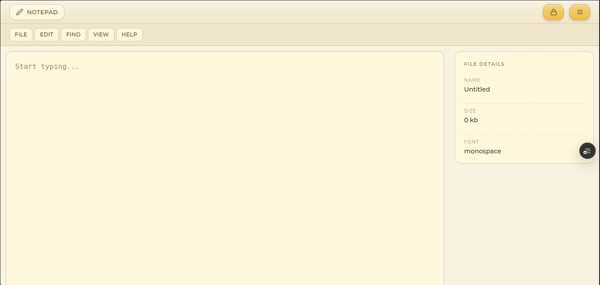

## Devkit - Getting Started

First, clone the repository and install the dependencies:

```bash
git clone git@github.com:eddyseed/DevKit.git
```
or
```bash
git clone https://github.com/eddyseed/DevKit.git
```

Then, navigate to the project directory and install the dependencies:

```bash
cd DevKit
yarn install
```
Create a `.env` file in the root directory and add the following environment variables:

```env
NEXT_PUBLIC_FIREBASE_API_KEY=<your-firebase-api-key>
NEXT_PUBLIC_FIREBASE_AUTH_DOMAIN=<your-firebase-auth-domain>
NEXT_PUBLIC_FIREBASE_PROJECT_ID=<your-firebase-project-id>
NEXT_PUBLIC_FIREBASE_STORAGE_BUCKET=<your-firebase-storage-bucket>
NEXT_PUBLIC_FIREBASE_MESSAGING_SENDER_ID=<your-firebase-messaging-sender-id>
NEXT_PUBLIC_FIREBASE_APP_ID=<your-firebase-app-id>
NEXT_PUBLIC_FIREBASE_MEASUREMENT_ID=<your-firebase-measurement-id>


TOTP_SECRET=<your-totp-secret>
```

- To get your Firebase configuration values, go to the [Firebase Console](https://console.firebase.google.com/), select your project, and navigate to Project Settings > General > Your apps > Firebase SDK snippet > Config.
- For TOTP_SECRET, you can generate a secret using a TOTP generator or library of your choice.

Finally, start the development server:

```bash
yarn run dev
```
The application will be available at `http://localhost:3000`.

Screenshots
---
Take a look at some screenshots of the Devkit application:

1. TOTP Authentication Screen

2. Main Dashboard

Project Structure
---
The project follows a feature-driven, scalable Next.js App Router architecture, keeping UI, logic, and styles well separated.

```
.
├── public/                    # Static assets (images, favicon, screenshots)
│   └── screenshots/
│
├── src/
│   ├── app/                   # Next.js App Router (routes & layouts)
│   │   ├── page.tsx           # Home page
│   │   ├── layout.tsx         # Root layout
│   │   ├── auth/              # Authentication routes
│   │   │   └── login/page.tsx
│   │   ├── tools/             # Tool-specific routes
│   │   │   ├── notepad/page.tsx
│   │   │   ├── todo/page.tsx
│   │   │   ├── vault/page.tsx
│   │   │   └── visualiser/page.tsx
│   │   └── api/               # API routes
│   │       ├── totp/route.ts
│   │       └── logout/route.ts
│
│   ├── components/            # Shared & reusable UI components
│   │   ├── layout/            # Navbar, Footer, layout components
│   │   ├── ui/                # Primitive UI components (buttons, inputs, menus)
│   │   ├── dialogs/           # App dialogs (Open, Save As, New File, etc.)
│   │   ├── dialog/            # Dialog system (provider, root, types)
│   │   ├── AuthForm.tsx
│   │   └── ToolTray.tsx
│
│   ├── features/              # Feature-based modules
│   │   ├── notepad/           # Notepad feature
│   │   │   ├── Notepad.tsx
│   │   │   ├── components/
│   │   │   ├── handlers/      # File & editor actions
│   │   │   ├── interfaces/
│   │   │   └── lib/            # Zustand store & logic
│   │   ├── todo/
│   │   ├── vault/
│   │   └── visualiser/
│
│   ├── styles/                # Global & modular CSS
│   │   ├── globals.css
│   │   ├── colors.css
│   │   ├── auth/
│   │   ├── layout/
│   │   └── tools/
│
│   ├── hooks/                 # Custom React hooks
│   │   └── useDialog.ts
│
│   ├── context/               # React Context providers
│   │   └── ToolContext.tsx
│
│   ├── utils/                 # Utility helpers & constants
│   ├── lib/                   # Shared logic (keyboard, validation, fonts)
│   ├── firebase/              # Firebase configuration & services
│   ├── types/                 # Global TypeScript definitions
│   └── proxy.ts               # App proxy / middleware logic
│
├── .env.local                 # Environment variables
├── next.config.ts             # Next.js configuration
├── tsconfig.json              # TypeScript configuration
├── eslint.config.mjs          # ESLint rules
├── package.json
└── README.md
```


References
---
- [Firebase Documentation](https://firebase.google.com/docs)
- [Next.js Documentation](https://nextjs.org/docs)
- [TOTP (Time-based One-Time Password) Overview](https://en.wikipedia.org/wiki/Time-based_One-time_Password_Algorithm)
- [Yarn Package Manager](https://yarnpkg.com/getting-started)
- [Setup Environment Variables in Next.js](https://nextjs.org/docs/basic-features/environment-variables)
- [GitHub Repository Guide](https://docs.github.com/en/repositories/creating-and-managing-repositories/about-repositories)

Support
---
If you encounter any issues or have questions, please open an issue on the [GitHub repository](https://github.com/eddyseed/DevKit/issues)
or submit a pull request for any improvements or bug fixes.

For further assistance, you can reach out via the [Google Form](https://forms.gle/aikgsj35Vw6bEpJE7)

- You can buy me a coffee here: [Buy Me a Coffee](https://buymeacoffee.com/rishabhjn1o)

## Thank you for using Devkit! Happy coding!