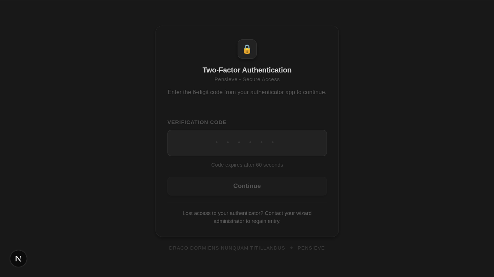
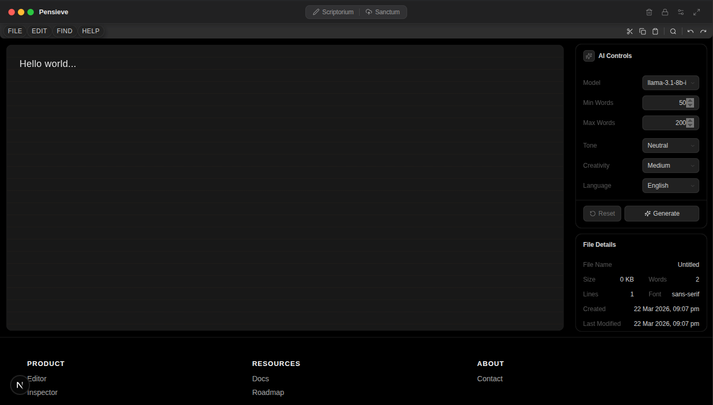
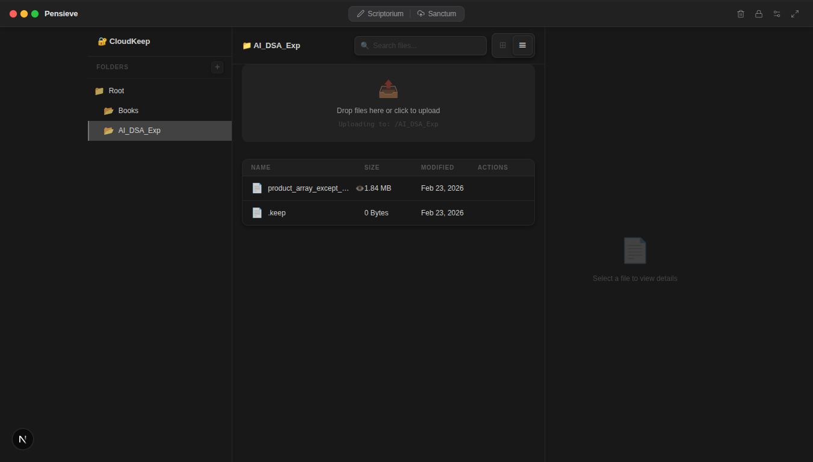

## Pensieve - Getting Started

First, clone the repository and install the dependencies:

```bash
git clone git@github.com:rishabhjn13/Pensieve.git
```
or
```bash
git clone https://github.com/rishabhjn13/Pensieve.git
```

Then, navigate to the project directory and install the dependencies:

```bash
cd Pensieve
yarn install
```
Create a `.env` file in the root directory and add the following environment variables:

```env
NEXT_PUBLIC_FIREBASE_API_KEY=<your-firebase-api-key>
NEXT_PUBLIC_FIREBASE_AUTH_DOMAIN=<your-firebase-auth-domain>
NEXT_PUBLIC_FIREBASE_PROJECT_ID=<your-firebase-project-id>
NEXT_PUBLIC_FIREBASE_STORAGE_BUCKET=<your-firebase-storage-bucket>
NEXT_PUBLIC_FIREBASE_MESSAGING_SENDER_ID=<your-firebase-messaging-sender-id>
NEXT_PUBLIC_FIREBASE_APP_ID=<your-firebase-app-id>
NEXT_PUBLIC_FIREBASE_MEASUREMENT_ID=<your-firebase-measurement-id>
GROQ_API_KEY=<your_groq_api_key_here>
NEXT_PUBLIC_SUPABASE_URL=<your_supabase_url_here>
NEXT_PUBLIC_SUPABASE_ANON_KEY=<your_supabase_anon_key_here>

TOTP_SECRET=<your-totp-secret>
NEXT_PUBLIC_SUPABASE_SETTINGS_USER_UUID=<your-supabase-settings-user-uuid>

NEXT_PUBLIC_APP_NAME=Pensieve
```

- To get your Firebase configuration values, go to the [Firebase Console](https://console.firebase.google.com/), select your project, and navigate to Project Settings > General > Your apps > Firebase SDK snippet > Config.
- For TOTP_SECRET, you can generate a secret using a TOTP generator or library of your choice.
- For GROQ_API_KEY, you can obtain it from your GROQ service account.
- For Supabase credentials, sign up at [Supabase](https://supabase.com/), create a new project, and find the URL and anon key in the project settings under API.
Finally, start the development server:

```bash
yarn run dev
```
The application will be available at `http://localhost:3000`.

Screenshots
---
Take a look at some screenshots of the Pensieve application:

1. TOTP Authentication Screen

2. Scriptorium Notepad

3. Sanctum Vault



References
---
- [Firebase Documentation](https://firebase.google.com/docs)
- [Next.js Documentation](https://nextjs.org/docs)
- [TOTP (Time-based One-Time Password) Overview](https://en.wikipedia.org/wiki/Time-based_One-time_Password_Algorithm)
- [Yarn Package Manager](https://yarnpkg.com/getting-started)
- [Setup Environment Variables in Next.js](https://nextjs.org/docs/basic-features/environment-variables)
- [GitHub Repository Guide](https://docs.github.com/en/repositories/creating-and-managing-repositories/about-repositories)

Support
---
If you encounter any issues or have questions, please open an issue on the [GitHub repository](https://github.com/rishabhjn13/Pensieve/issues)
or submit a pull request for any improvements or bug fixes.

For further assistance, you can reach out via the [Google Form](https://forms.gle/aikgsj35Vw6bEpJE7)

- You can buy me a coffee here: [Buy Me a Coffee](https://buymeacoffee.com/rishabhjn1o)


## Thank you for using Pensieve! Happy coding!
